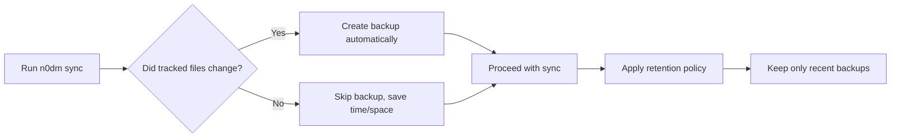

# 🏠 n0dm — Your Dotfiles, Simplified

> **Smart, safe, and simple dotfile management for Arch Linux**  
> Built on [Yadm](https://yadm.io) • No symlinks • Smart backups • GitHub sync

<p align="center">
  
  
  
  
</p>

<p align="center">
  <a href="#-quick-start">⚡ Quick Start</a> •
  <a href="#-quick-reference">📖 Quick Reference</a> •
  <a href="#-commands">📋 Commands</a> •
  <a href="#-automation">🤖 Automation</a> •
  <a href="#-faq">❓ FAQ</a>
</p>

---

## 🎯 Why n0dm?

| Problem | n0dm Solution |
|---------|--------------|
| 😰 "I edited my config on Laptop A, now it's different on Desktop B" | **Two-way sync** keeps all your devices in harmony |
| 💥 "I broke my config and can't remember what it was before" | **Smart backups** auto-save before changes, restore anytime |
| 🔗 "Symlinks keep breaking and I don't understand them" | **No symlinks!** Your files stay where they belong |
| ⚙️ "I want automation but don't know systemd" | **One-line setup** for auto-sync after updates |
| 🧩 "Dotfile managers are too complex" | **Simple commands** that just work |

---

## ✨ Features at a Glance

```
✅ No symlinks — files stay in their natural home (~/.bashrc, not ~/.dotfiles/.bashrc)
✅ Smart backups — only backup when files actually change (saves space!)
✅ Two-way sync — pull from GitHub, push your changes, resolve conflicts easily
✅ All Yadm commands — every native yadm command works with `n0dm` prefix
✅ Atomic self-update — `n0dm update` with SHA256 checksum verification
✅ Retention policy — auto-cleanup old backups, never fill your disk
✅ Non-technical friendly — clear messages, helpful prompts, safe defaults
```

---

## 🚀 Quick Start

### 1️⃣ Install Dependencies

```bash
# Install Yadm (the engine n0dm runs on)
sudo pacman -S yadm

# Optional but recommended: GitHub CLI for easier auth
sudo pacman -S github-cli
```

### 2️⃣ Install n0dm

#### 🚀 Quick Install (Recommended)

```bash
# One-line install - handles dependencies automatically!
curl -fsSL https://raw.githubusercontent.com/noeltz/n0dm/main/install.sh | bash
```

This will:
- ✅ Check for required packages (yadm, git, curl)
- ✅ Install missing dependencies via pacman
- ✅ Download and install n0dm to `~/.local/bin`
- ✅ Verify the installation works

#### 📦 Manual Install

```bash
# Download the script
mkdir -p ~/.local/bin
curl -fsSL https://raw.githubusercontent.com/noeltz/n0dm/main/n0dm \
  -o ~/.local/bin/n0dm
chmod +x ~/.local/bin/n0dm

# Add to your PATH if not already there
echo 'export PATH="$HOME/.local/bin:$PATH"' >> ~/.bashrc
source ~/.bashrc
```

### 3️⃣ Initialize Your Dotfiles Repo

```bash
# Start fresh with a new GitHub repository
n0dm init

# Or restore from an existing repo
n0dm clone username/dotfiles
```

> 💡 **First time?** `n0dm init` will:
> 1. Ask for your GitHub username/repo (e.g., `alice/dotfiles`)
> 2. Create the repo on GitHub if it doesn't exist
> 3. Set up a `~/.gitignore` file to exclude caches and large folders
> 4. Configure Git with your name/email

### 4️⃣ Track Your First File

```bash
# Add your .bashrc to version control
n0dm track ~/.bashrc

# See what's being tracked
n0dm status
```

### 5️⃣ Sync to GitHub

```bash
# One command to commit + push + backup (auto-generates meaningful messages!)
n0dm sync "Added my bashrc"
```

🎉 **You're done!** Your dotfiles are now safely backed up and ready to sync across devices.

---

## 📖 Quick Reference

### Most Used Commands

```bash
n0dm track ~/.bashrc              # Add file to tracking
n0dm untrack ~/.cache/file        # Remove from tracking (keep file)
n0dm sync "Updated config"        # Backup + commit + push
n0dm status                       # Check what's tracked
n0dm list                         # List all tracked files
```

### Common Workflows

| Task | Command |
|------|---------|
| **First time setup** | `n0dm init` → `n0dm track ~/.bashrc` → `n0dm sync "Initial"` |
| **After editing config** | `n0dm sync "Updated kitty"` |
| **Stop tracking a file** | `n0dm untrack ~/.oldconfig` → `n0dm sync "Remove old"` |
| **See what changed** | `n0dm status` |
| **View commit history** | `n0dm log --oneline` |

### ⚡ One-Liner for New Users

```bash
n0dm init && n0dm track ~/.bashrc ~/.zshrc && n0dm sync "Initial dotfiles"
```

---

## 📝 Managing What Gets Tracked

### ⚠️ Important: Don't Track Everything!

Unlike regular Git repos, your home directory contains **thousands of files** you don't want in version control. n0dm helps you track only what matters.

### 🛡️ The `.gitignore` Approach

n0dm creates a `~/.gitignore` file during `init` with this pattern:

```gitignore
# Ignore everything at root level
*

# But allow directories we want to track
!.bashrc
!.bash_profile
!.zshrc
!.profile
!.gitignore
!.config/

# Ignore specific .config subdirectories (not tracked)
.config/*
!.config/kitty/
!.config/nvim/
!.config/niri/
```

**How it works:**
- `*` — Ignore all files by default
- `!.bashrc` — **Un-ignore** specific files (the `!` means "except")
- `.config/*` — Ignore everything in `.config`
- `!.config/kitty/` — Except the kitty folder

### ✅ Best Practices

| Do ✅ | Don't ❌ |
|-------|---------|
| `n0dm track ~/.bashrc` — explicit files | `n0dm track -A` — adds EVERYTHING |
| `n0dm track ~/.config/nvim/` — specific dirs | `n0dm track .` — adds from root |
| Create `~/.gitignore` first | Skip the ignore file |
| Commit `.gitignore` first | Add files before `.gitignore` |

### 📋 Recommended Workflow

```bash
# 1. Initialize (creates ~/.gitignore automatically)
n0dm init

# 2. Add .gitignore FIRST and commit it
n0dm track ~/.gitignore
n0dm commit -m "Add .gitignore"

# 3. Now add your dotfiles explicitly
n0dm track ~/.bashrc ~/.zshrc ~/.gitconfig
n0dm track ~/.config/kitty/ ~/.config/nvim/

# 4. Sync to GitHub
n0dm sync "Initial dotfiles"
```

### 🔍 Check What's Being Tracked

```bash
# See staged files before committing
n0dm status --short

# List all tracked files
n0dm list

# See untracked files (what would be added with -A)
n0dm status -u
```

### 🚫 Common Files to Ignore

```gitignore
# Caches
.cache/
.bun/
.npm/
.pnpm/
.yarn/
node_modules/

# Downloads and media
Downloads/
Pictures/
Videos/
Music/
Public/

# System and state
.local/share/Trash/
.local/state/
.thumbnails/

# IDE and editor caches
.vscode/
.idea/
*.swp
*.swo
```

> 💡 **Tip:** The default `~/.gitignore` created by `n0dm init` already includes these. Customize it to match your setup!

---

## 📋 Command Reference

### 🔧 Core Commands

| Command | What It Does | Example |
|---------|-------------|---------|
| `n0dm init` | Create a new dotfiles repository | `n0dm init` |
| `n0dm clone <repo>` | Restore dotfiles from GitHub | `n0dm clone alice/dotfiles` |
| `n0dm connect [repo]` | Connect to GitHub remote | `n0dm connect alice/dotfiles` |
| `n0dm track <file>` | Add a file to version control | `n0dm track ~/.vimrc` |
| `n0dm untrack <file>` | Remove from tracking (keeps file) | `n0dm untrack ~/.cache/file` |
| `n0dm sync [message]` | **Smart sync**: auto-generates commit message, backup → pull → commit → push | `n0dm sync` or `n0dm sync "Updated aliases"` |
| `n0dm status` | See what's tracked and if files are in sync | `n0dm status` |

### 🔄 Automation & Scheduling

| Command | What It Does | Example |
|---------|-------------|---------|
| `n0dm schedule [freq]` | Enable auto-sync timer (hourly/daily/weekly) | `n0dm schedule daily` |
| `n0dm schedule status` | Check if auto-sync is enabled | `n0dm schedule status` |
| `n0dm schedule off` | Disable auto-sync timer | `n0dm schedule off` |
| `n0dm hook install` | Install pacman hook (needs sudo) | `sudo n0dm hook install` |
| `n0dm hook status` | Check if pacman hook installed | `n0dm hook status` |
| `n0dm hook uninstall` | Remove pacman hook | `sudo n0dm hook uninstall` |

### 💾 Backup & Restore

| Command | What It Does | Example |
|---------|-------------|---------|
| `n0dm backup [label]` | Create a manual backup snapshot | `n0dm backup "before-nvim-upgrade"` |
| `n0dm backups` | List all available backups | `n0dm backups` |
| `n0dm restore <id>` | Restore your dotfiles from a backup | `n0dm restore 20260223_143022_pre-sync` |
| `n0dm cleanup` | Remove old backups (auto-runs after sync) | `n0dm cleanup` |

### 🔍 Inspection & Debugging

| Command | What It Does | Example |
|---------|-------------|---------|
| `n0dm diff [file]` | See differences between repo and home | `n0dm diff ~/.bashrc` |
| `n0dm list` | List all tracked files *(passes through to yadm)* | `n0dm list` |
| `n0dm conflicts [--fix]` | Check for unresolved merge conflicts | `n0dm conflicts` or `n0dm conflicts --fix` |
| `n0dm mergetool` | Open visual merge tool for conflicts | `n0dm mergetool` |
| `n0dm health` | Run comprehensive health check | `n0dm health` |

### 🔄 All Git Commands Work Too!

> 💡 **Any Git/Yadm command works with `n0dm` prefix:**

```bash
n0dm commit -m "msg"      # Commit changes
n0dm push                 # Push to GitHub
n0dm pull                 # Pull from GitHub
n0dm log --oneline        # View commit history
n0dm branch               # Manage branches
n0dm encrypt file.gpg     # Encrypt sensitive files
```

---

## 🤔 What Is n0dm? (In Plain English)

### 📁 Your Dotfiles, Explained

**Dotfiles** are configuration files that customize your Linux experience:
- `~/.bashrc` — customizes your terminal
- `~/.config/nvim/init.lua` — configures Neovim
- `~/.gitconfig` — sets your Git preferences

These files live in your **home directory** (`~`) and make your system *yours*.

### 🔁 The Problem n0dm Solves

```
🖥️ Laptop                          ☁️ GitHub                          🖥️ Desktop
┌─────────────────┐              ┌─────────────────┐              ┌─────────────────┐
│ ~/.bashrc       │ ──push──►   │ username/       │ ◄─pull──    │ ~/.bashrc       │
│ (your edits)    │              │ dotfiles/       │              │ (gets updates)  │
└─────────────────┘              │ .bashrc         │              └─────────────────┘
                                 └─────────────────┘
```

Without a tool like n0dm:
- ❌ You'd manually copy files between machines (error-prone)
- ❌ You might lose changes if you forget to backup
- ❌ Conflicts happen when both machines edit the same file

**n0dm automates this safely**, with backups and conflict help built-in.

### 🧠 Smart Backups: How They Work



**Benefits:**
- 🗂️ **Space-efficient**: No backup if nothing changed
- ♻️ **Auto-cleanup**: Old backups removed based on your settings
- 🛡️ **Safety net**: Always backup before risky operations like `restore`

### ⚙️ Maintenance

| Command | What It Does | Example |
|---------|-------------|---------|
| `n0dm update` | Check for and install n0dm updates (with SHA256 verification) | `n0dm update` |
| `n0dm mergetool` | Open visual tool to resolve conflicts | `n0dm mergetool` |
| `n0dm help` | Show help guide | `n0dm help` |

---

## 🤖 Automation: Set It and Forget It

### ⏰ Auto-Sync Timer (Recommended)

Never forget to sync your dotfiles! Set up automatic syncing with one command:

```bash
# Enable automatic sync
n0dm schedule              # Hourly (default)
n0dm schedule hourly     # Sync every hour
n0dm schedule daily      # Sync once per day
n0dm schedule weekly     # Sync once per week
```

**What happens:**
- Creates systemd timer and service automatically
- Runs `n0dm sync --yes` at your chosen interval
- ✅ Automatically updates n0dm before each sync
- ✅ Creates backups when files change
- ✅ Sends desktop notifications on success/failure

```bash
# Check timer status
n0dm schedule status

# Disable auto-sync
n0dm schedule off
```

### 🪝 Pacman Hook (System Updates)

Automatically sync after system updates:

```bash
# Install the hook (requires sudo)
sudo n0dm hook install

# Check hook status
n0dm hook status

# Remove the hook
sudo n0dm hook uninstall
```

**What happens:**
- After every `pacman -Syu`, `paru -Syu`, or `yay -Syu`
- n0dm automatically updates itself first
- Then syncs your dotfiles to GitHub
- Works with pacman and all AUR helpers (paru, yay, etc.)

> 🔁 **Note:** Requires root privileges to install the hook.

### 🔐 Safe Mode for Automation

For fully automated runs with error handling:

```bash
n0dm sync --safe --yes
```

**Safe mode includes:**
- ✅ Aborts immediately on conflicts (no broken merge state)
- ✅ Sends desktop notifications for any issues
- ✅ Auto-updates n0dm before syncing
- ✅ Creates backups when needed

**Notification examples:**
- ✅ "n0dm Sync Complete" - Success
- ⚠️ "n0dm Conflict Detected" - Needs your attention
- ⚠️ "n0dm Sync Failed" - Check manually

---

## 🏥 Health Check

Run a comprehensive diagnostic:

```bash
n0dm health
# or
n0dm doctor
```

**Checks:**
- ✅ Yadm repository initialized
- ✅ Remote configured and reachable
- ✅ No unresolved merge conflicts
- ✅ Backup status and count
- ✅ Local/remote sync status
- ✅ Auto-sync timer status

**Example output:**
```
=== n0dm Health Check ===

➜ Checking yadm repository...
✓ Yadm repository initialized
➜ Checking remote configuration...
✓ Remote configured: https://github.com/user/dotfiles.git
➜ Checking remote connectivity...
✓ Remote is reachable
➜ Checking for unresolved conflicts...
✓ No merge conflicts
➜ Checking backup status...
  Backups stored: 3 / 10
  Retention: 30 days
✓ Backups available
➜ Checking sync status...
✓ Local and remote are in sync

✓ Health check passed - no issues found
```

---

## 🛡️ Safety First: How n0dm Protects You

### 🔐 Pre-Sync Backups (Smart)

```bash
$ n0dm sync "Updated config"
➜ Changes detected in tracked files, creating pre-sync backup...
✓ Backup created: 20260223_143022_pre-sync
➜ Pulling remote changes...
✓ Sync complete!
```

**Smart logic means:**
- ✅ Backup created **only if** tracked files changed since last backup
- ✅ First sync always backs up (no previous state)
- ✅ `--no-backup` flag skips this for automation (when you trust the changes)

### ♻️ Retention Policy (No Disk Pollution)

n0dm automatically cleans up old backups:

```bash
# Default settings (customizable via environment variables)
MAX_BACKUPS=10              # Keep at most 10 backups
BACKUP_RETENTION_DAYS=30    # Delete backups older than 30 days
```

**Customize in your shell config (`~/.bashrc`):**
```bash
# Keep more backups
export N0DM_MAX_BACKUPS=20

# Retain backups for 90 days
export N0DM_BACKUP_RETENTION=90
```

### 🔄 Conflict Resolution Made Simple

When the same file is edited on two machines:

```bash
$ n0dm sync
⚠ Merge conflicts detected!
=== Resolving Merge Conflicts ===

=== Conflict #1: .bashrc ===
--- Local changes (yours) ---
+alias ll='ls -la'
--- Remote changes (GitHub) ---
+alias ll='ls -la -h'

Choose: (L)ocal, (R)emote, (M)erge, (S)kip, (Q)uit: L
✓ Kept local version
✓ Run 'n0dm sync' to complete
```

**To resolve (automatic):**
1. Run `n0dm conflicts --fix` (opens interactive wizard)
2. For each conflict, choose: Local / Remote / Merge / Skip
3. Run `n0dm sync` again to complete

**To resolve (visual):**
1. Run `n0dm mergetool` (opens Meld, vimdiff, or your configured tool)
2. Edit the file visually, save, and close
3. Run `n0dm sync` again to complete

> 💡 **Pro tip:** Set up a merge tool first:
> ```bash
> sudo pacman -S meld
> git config --global merge.tool meld
> ```

### 🔄 Handling Divergent Branches

When your local and remote branches have different commit histories (e.g., you synced on Desktop, then made different changes on Laptop), n0dm will detect this and offer options:

```bash
$ n0dm sync
⚠ Branches have diverged: local and remote have different commit histories
➜ Local has 1 commit(s), remote has 7

Choose: (R)ebase local on remote, (M)erge remote, (H)ard reset to remote, (Q)uit: H
```

| Option | When to Use | What Happens | Risk Level |
|--------|-------------|--------------|------------|
| **Rebase** | You want to preserve your local changes on top of remote | Your commits are replayed after remote's commits | 🟢 Low |
| **Merge** | You want to preserve both histories intact | Creates a merge commit combining both | 🟢 Low |
| **Hard Reset** | Remote is authoritative, discard all local changes | ⚠️ **Destructive!** All local commits and changes lost | 🔴 High |
| **Quit** | You want to resolve manually | No changes made, return to prompt | None |

> ⚠️ **Warning:** Hard reset will **permanently discard** all your local commits and unstaged changes. A backup is automatically created before reset, so you can restore if needed.

#### Hard Reset Example

When you choose (H)ard reset, n0dm shows exactly what will be lost:

```bash
Choose: (H)ard reset to remote, (Q)uit: H
⚠️  Hard reset: This will DISCARD all local changes!

Upstream branch: origin/main

Local commits that will be lost:
  f72c9c7 Auto-sync

Unstaged changes (will be discarded):
  .config/nvim/init.lua

Untracked files (will be preserved):
  .config/myapp/settings.json

Proceed with hard reset to origin/main? [y/N]: y
➜ Creating pre-reset backup...
✓ Backup created: 20260225_143022_pre-hard-reset
➜ Resetting to origin/main...
✓ Reset complete!
Your local state now matches origin/main
To restore if needed: n0dm restore 20260225_143022_pre-hard-reset
```

#### Untracked Files and Merging

If you have untracked files that conflict with files from remote, n0dm will offer solutions:

```bash
error: The following untracked working tree files would be overwritten by merge:
	.config/noctalia/plugins/simple-notes/BarWidget.qml
	.config/noctalia/plugins/simple-notes/Main.qml
	...

Options:
  (H)ard reset to remote - discard local changes
  (B)ackup and remove untracked files, then merge
  (Q)uit
```

Choose based on your situation:
- **(H)** - Remote is authoritative, you don't need your local changes
- **(B)** - You want to keep your untracked files, move them to backup, then merge
- **(Q)** - Manually resolve the situation

### 🛑 Safe Defaults for Non-Technical Users

| Feature | Why It Matters |
|---------|---------------|
| **Clear prompts** | "Proceed with restore? [y/N]" — you're always in control |
| **Dry-run mode** | `n0dm sync --dry-run` shows what *would* happen, no changes made |
| **Non-interactive flag** | `--yes` for automation, but interactive by default for safety |
| **Safe mode** | `--safe` aborts on errors, sends desktop notifications |
| **Rollback on error** | If sync fails halfway, n0dm can restore from the pre-sync backup |
| **Lock file** | Prevents two n0dm processes from running at once (no race conditions) |
| **Desktop notifications** | Get alerted on sync success/failure (requires `--yes` or `--safe`) |

---

## 🔧 Troubleshooting

### Common Issues

| Problem | Solution |
|---------|----------|
| **"No commits yet"** | Run `n0dm sync "Initial"` after tracking files |
| **"Remote has different history"** | Use `n0dm sync --force` for first push |
| **"File not tracked"** | Run `n0dm track ~/.file` first |
| **"Merge conflicts"** | Run `n0dm conflicts --fix` or `n0dm mergetool` |
| **"Branches have diverged"** | Choose (R)ebase, (M)erge, or (H)ard reset when prompted |
| **"Nothing to commit"** | Check `n0dm status` for staged changes |

### Quick Diagnostics

```bash
n0dm status           # Check repo state
n0dm list             # See tracked files
n0dm doctor           # Run diagnostics
```

### Get Help

```bash
n0dm help             # Show all commands
n0dm --help           # Command-specific help
```

---

## ❓ Frequently Asked Questions

### 🤷 "I'm not technical — is this safe for me?"

**Yes!** n0dm is designed with safety in mind:
- 🛡️ Backups before risky operations
- ✅ Clear "yes/no" prompts — nothing happens without your approval
- 🔍 `--dry-run` lets you preview changes
- 🆘 `n0dm doctor` diagnoses and fixes common issues automatically

Start with `n0dm track ~/.bashrc` and `n0dm sync` — that's all you need to begin.

### 🔗 "Why no symlinks? Isn't that how dotfile managers work?"

Most tools use symlinks to keep versioned files separate from your home directory. n0dm (via Yadm) tracks files **in place**:

```
Traditional symlink approach:
~/.dotfiles/bash/.bashrc  ← real file (in git)
~/.bashrc                 ← symlink → ~/.dotfiles/bash/.bashrc

n0dm approach (no symlinks):
~/.bashrc                 ← real file (tracked by git directly)
```

**Benefits:**
- 🎯 Files stay where apps expect them
- 🔧 No broken symlinks if you move/delete the repo folder
- 🧭 Simpler mental model: "my config file is my config file"

### 💾 "Won't backups fill up my disk?"

No! n0dm's **smart backup system** prevents this:
1. Only backs up when tracked files actually change
2. Automatically deletes backups older than 30 days (configurable)
3. Keeps only the 10 most recent backups (configurable)
4. Uses efficient file copying (hard links where possible)

**Check backup usage anytime:**
```bash
du -sh ~/.local/share/n0dm/backups
n0dm backups  # List what's stored
```

### 🔄 "How do I use n0dm on multiple computers?"

1. **On your main machine:**
   ```bash
   n0dm init          # Create repo on GitHub
   n0dm track ~/.bashrc ~/.vimrc  # Add your configs
   n0dm sync "Initial commit"
   ```

2. **On your other machines:**
   ```bash
   n0dm clone username/dotfiles  # Restore everything
   ```

3. **Workflow going forward:**
   - Edit a config on any machine
   - Run `n0dm sync "what I changed"` to save + upload
   - Other machines auto-pull changes via systemd timer (or run `n0dm sync` manually)

### 🐛 "Something went wrong — how do I recover?"

**Option 1: Restore from n0dm backup**
```bash
n0dm backups                    # See available backups
n0dm restore 20260223_143022_pre-sync  # Restore to that point
```

**Option 2: Use Git directly (n0dm is just a wrapper)**
```bash
cd ~/.local/share/yadm/repo.git  # Yadm's bare git repo
git log --oneline                # See history
git checkout <commit>            # Revert to a specific state
# Then run: n0dm sync to apply to home directory
```

**Option 3: Run diagnostics**
```bash
n0dm doctor  # Checks dependencies, config, and offers fixes
```

### 🌐 "Can I use this with GitLab or other Git hosts?"

Yes! n0dm uses standard Git under the hood. To use GitLab:

```bash
n0dm init
# When prompted for repo, enter: gitlab.com/username/dotfiles
# Or manually set the remote:
cd ~/.local/share/yadm/repo.git
git remote set-url origin git@gitlab.com:username/dotfiles.git
```

GitHub CLI (`gh`) is optional — n0dm falls back to standard Git auth if it's not installed.

---

## 🎨 Customization

### 🌈 Colors & Output

n0dm uses colorful, readable output by default. To disable colors (e.g., for logs):

```bash
export NO_COLOR=1
n0dm sync
```

### ⚙️ Environment Variables

| Variable | Default | Purpose |
|----------|---------|---------|
| `N0DM_MAX_BACKUPS` | `10` | Maximum number of backups to retain |
| `N0DM_BACKUP_RETENTION` | `30` | Days to keep backups before cleanup |
| `N0DM_YES` | `false` | Set to `true` for non-interactive mode (automation) |
| `NO_COLOR` | *unset* | Set to disable colored output |

**Example: Set in `~/.bashrc`**
```bash
export N0DM_MAX_BACKUPS=20
export N0DM_BACKUP_RETENTION=90
```

### 🔧 Configure Merge Tool

For visual conflict resolution:

```bash
# Install a merge tool
sudo pacman -S meld  # or vim, code, kdiff3

# Configure Git to use it
git config --global merge.tool meld
git config --global mergetool.meld.cmd "meld --auto-merge \$LOCAL \$BASE \$REMOTE --output \$MERGED"
```

Now `n0dm mergetool` will open Meld when conflicts occur.

---

## 🤝 Contributing & Support

### 🐛 Found a Bug?

1. Check the [Issues](https://github.com/noeltz/n0dm/issues) page first
2. Run `n0dm doctor` to gather diagnostic info
3. Open a new issue with:
   - Your Arch Linux version (`cat /etc/arch-release`)
   - n0dm version (`n0dm version`)
   - Steps to reproduce the issue
   - Output from `n0dm doctor`

### 💡 Have an Idea?

We love suggestions! Open a [Discussion](https://github.com/noeltz/n0dm/discussions) to share:
- Feature requests
- Workflow improvements
- Documentation ideas

### 🔧 Want to Contribute Code?

1. Fork the repository
2. Create a feature branch: `git checkout -b feat/your-idea`
3. Make your changes (keep it simple and well-commented)
4. Test thoroughly with `n0dm doctor` and manual syncs
5. Submit a Pull Request with a clear description

---

## 📜 License

n0dm is released under the [MIT License](LICENSE).  
Built with ❤️ for the Arch Linux community.

---

## 🙏 Acknowledgments

- [Yadm](https://yadm.io) — The brilliant bare-git engine that makes n0dm possible
- [Arch Linux](https://archlinux.org) — For the perfect distro to build tools like this
- The dotfiles community — For inspiring simpler, safer workflows

---

> 💬 **Still have questions?**  
> Run `n0dm help` anytime, or open an issue on GitHub.  
> We're here to help you manage your dotfiles with confidence. 🚀

<p align="center">
  <sub>Made with ☕ and clean bash scripts</sub>
</p>
